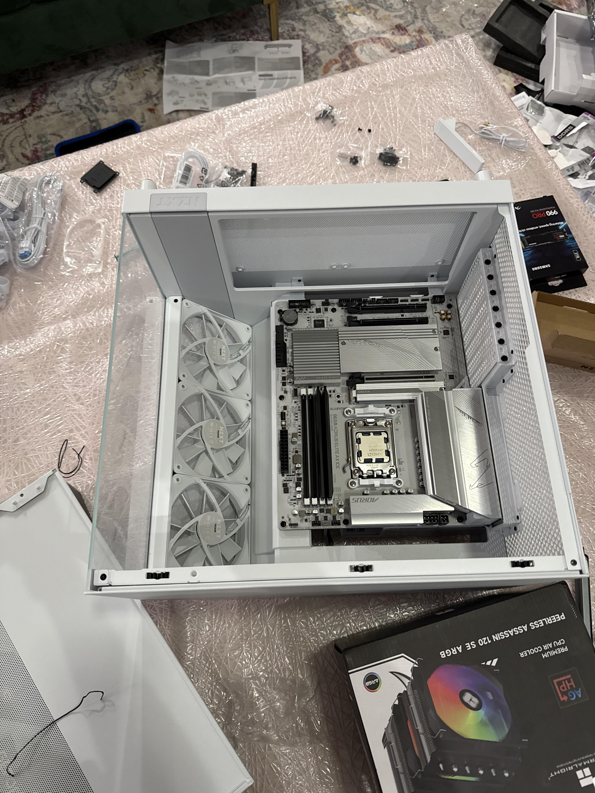
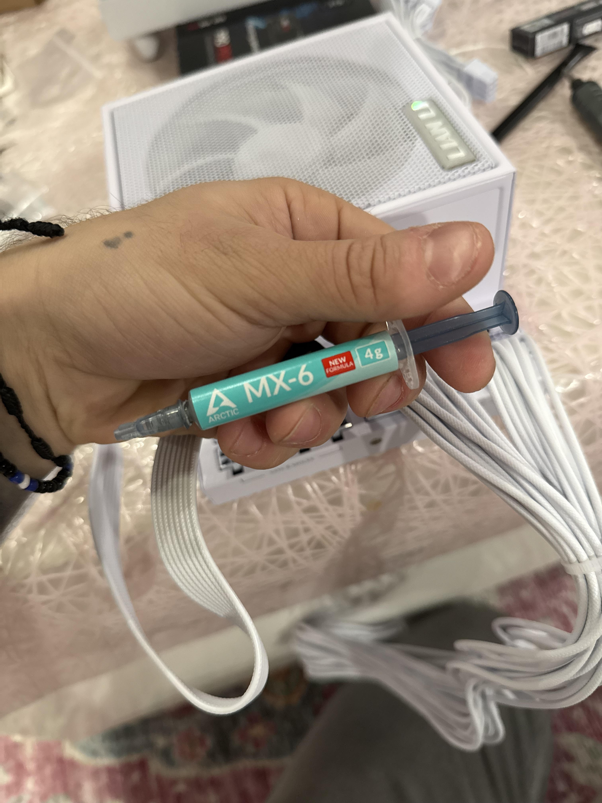
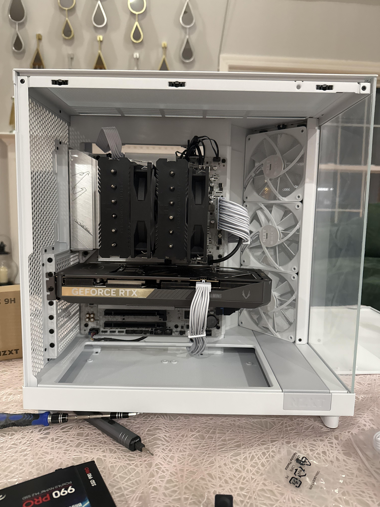
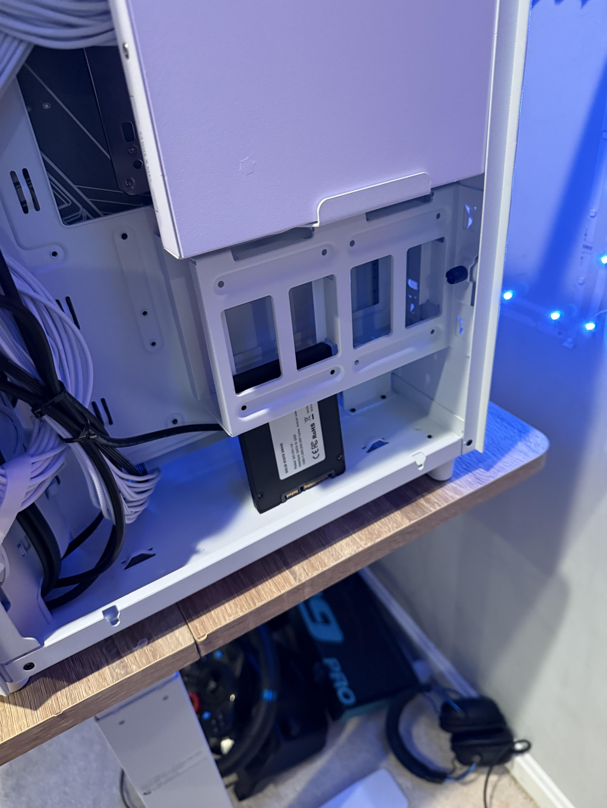
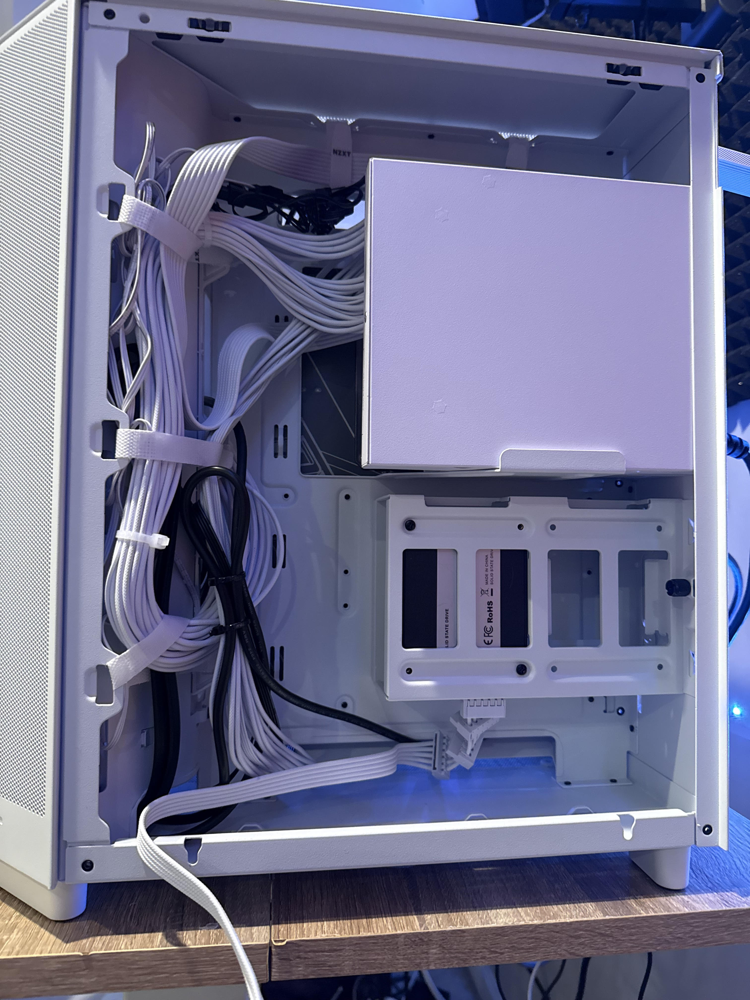
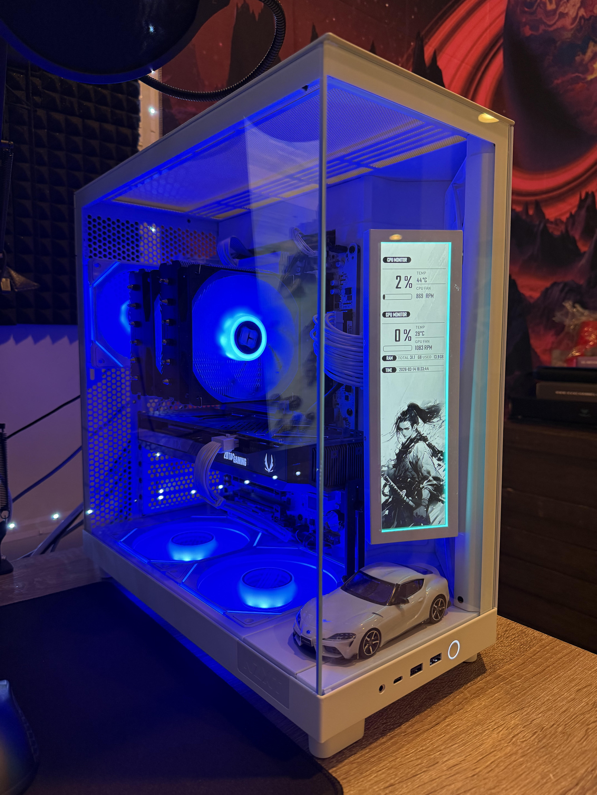

# Comprehensive Build Process Guide

This document outlines a thorough step-by-step guide to building a PC with the following components:
- **CPU**: AMD Ryzen 7 9700X
- **Motherboard**: Gigabyte B650
- **GPU**: RTX 5070 Ti

### Step 1: Workspace Preparation
1. **Choose a clean, organized workspace**: Make sure there is enough space to work without clutter. 
2. **Gather tools**: You will need a Phillips screwdriver, anti-static wrist strap, and other basic tools.

### Step 2: Prepare the Motherboard
1. **Inspect the motherboard packaging**: Ensure all components are included.
2. **Install the CPU**: Open the CPU socket, align the CPU, and secure it in place.
3. **Apply thermal paste**: Use a pea-sized amount on the CPU.
4. **Install the CPU cooler**: Secure it according to the cooler's instructions.

### Step 3: Install RAM
1. **Open RAM slots**: Push the clips down on the RAM slots.
2. **Insert RAM sticks**: Align them correctly and push them down until they click into place.

### Step 4: Prepare the Case
1. **Remove side panels**: Unscrew and set aside all necessary panels.
2. **Install standoffs**: Ensure they are in the right position for the motherboard.

### Step 5: Install the Motherboard
1. **Align the motherboard**: Place it on the standoffs.
2. **Secure it**: Using screws, secure the motherboard in place.

### Step 6: Install Power Supply Unit (PSU)
1. **Place the PSU**: Fit it into the designated area in the case.
2. **Secure it**: Use screws to fasten the PSU.

### Step 7: Connect Power Cables
1. **24-pin ATX cable**: Connect it from the PSU to the motherboard.
2. **CPU power cable**: Connect the 4/8-pin power connector to the CPU.

### Step 8: Install Storage Drives
1. **Mount SSD/HDD**: Use the dedicated slots or trays in the case.
2. **Connect SATA cables**: Attach them from the drives to the motherboard.

### Step 9: Install GPU
1. **Insert the GPU**: Place the graphics card into the PCIe slot.
2. **Secure it**: Fasten it with screws.
3. **Connect PCIe power cables**: Attach from the PSU to the GPU.

### Step 10: Install Case Fans
1. **Locate fan slots**: Determine where additional fans can be mounted.
2. **Install and connect**: Secure fans and connect them to the motherboard.

### Step 11: Cable Management
1. **Organize cables**: Use zip ties and clips to tidy up the cables for better airflow.

### Step 12: First Boot Preparation
1. **Double-check connections**: Ensure all cables are securely connected.
2. **Power on the system**: Check to see if everything powers up.

### Step 13: Enter BIOS
1. **Access BIOS/UEFI**: Press the designated key during boot (usually DEL or F2).

### Step 14: Configure BIOS Settings
1. **Enable XMP profile**: If using high-performance RAM.
2. **Set boot order**: Make sure your installation device is prioritized.

### Step 15: Install Operating System
1. **Insert OS installation media**: USB or DVD.
2. **Follow OS installation prompts**: Complete as prompted.

### Step 16: Install Drivers
1. **Download and install drivers** for all components including GPU, motherboard, and any peripherals.

### Step 17: Update Windows
1. **Check for updates**: Ensure Windows is up to date for best performance.

### Step 18: Install Essential Software
1. **Install necessary applications**: Antivirus, browsers, etc.

### Step 19: Optimize Settings
1. **Optimize performance settings**: Adjust power settings and graphics settings based on usage.

### Step 20: Verify System
1. **Run benchmarks**: Check system performance using benchmarking tools.

### Step 21: Monitor Temperatures
1. **Use software**: Monitor CPU/GPU temperatures to ensure cooling.

### Step 22: Final Check
1. **Inspect physical connections**: Make sure everything is secure.
2. **Look for cable interference**: Adjust if necessary.

### Step 23: Mark the Build as COMPLETE
1. **Ensure stability**: Wait a few days of usage for testing.

### Step 24: Celebrate!
- **Enjoy your new system!** You've successfully completed the build process!

- ## Build Photos

### 1. Motherboard Installed in the Case

### 2. Thermal Paste and Cooler Prep

### 3. GPU Installed

### 4. Rear SSD Mount

### 5. Cable Management

### 6. Finished Build Angle View

